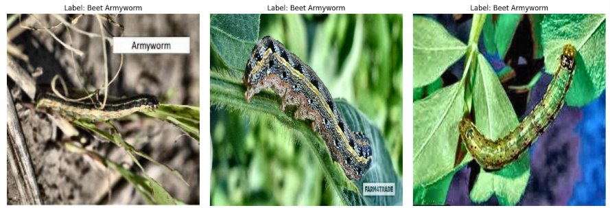
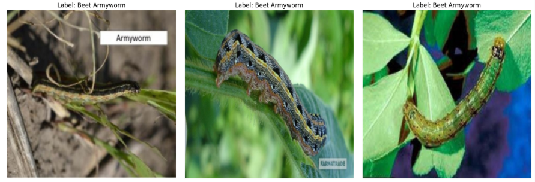
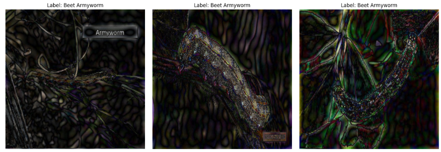
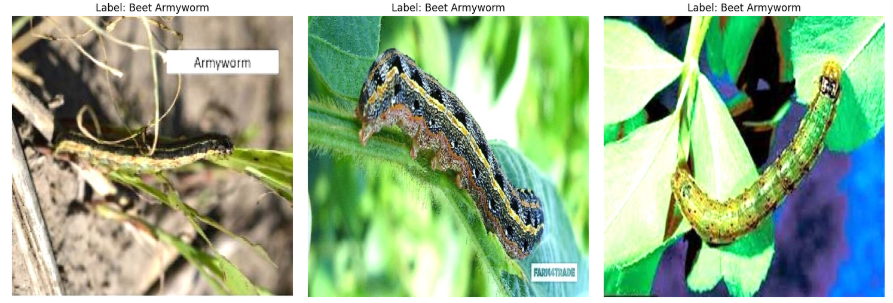
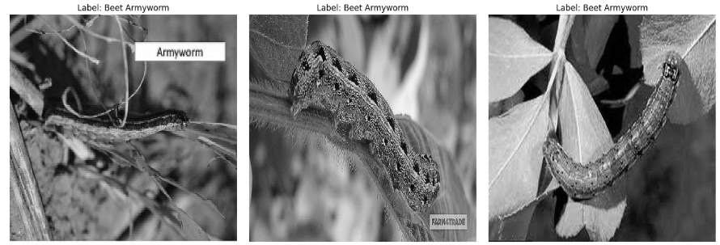
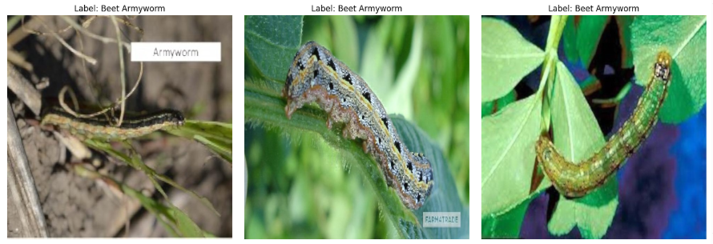
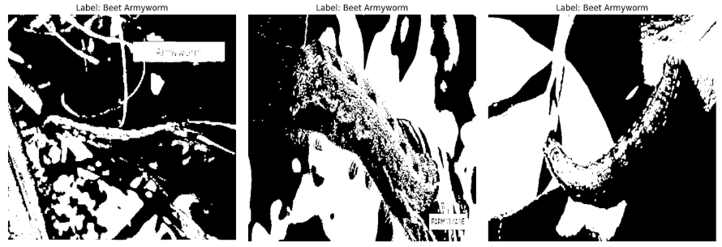
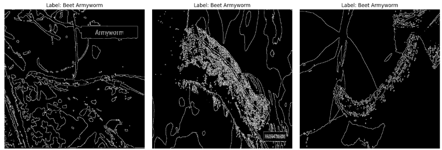

# Evaluating the Impact of Digital Image Processing on Model Performance in Visual Classification

This project systematically evaluates how various Digital Image Processing (DIP) techniques affect the performance of Deep Learning models, specifically focusing on AlexNet for a pest classification task.

The research is divided into two main stages:
- **Model Selection**: Benchmarking 12 different CNN architectures to identify performance baselines
- **DIP Implementation**: Applying 19 different image processing techniques (Filtering, Morphological Operations, Structural Analysis) to the weakest performing model (AlexNet)

---

## 📂 Included Files

| File Name | Description |
|-----------|-------------|
| `model_selection_part_01.ipynb` | Fine-tuning and evaluation of 7 CNN models (ResNet, AlexNet, DenseNet, etc.) |
| `model_selection_part_02.ipynb` | Evaluation of 6 additional architectures (Inception, Xception, ShuffleNet, etc.) |
| `DIP_implementation_part_01.ipynb` | Implementation of histogram-based and filtering techniques (Gaussian Blur, AHE, etc.) |
| `DIP_implementation_part_02.ipynb` | Implementation of morphological operations, edge detection, and structural analysis |

---

## 📊 Phase 1: Model Benchmarking & Selection

Evaluated 12 pre-trained CNN models on the Jute Pest Dataset. **ResNet18** achieved highest accuracy, **AlexNet** performed lowest and was selected for DIP impact study.

| Model | Accuracy | Precision | Recall | F1-Score |
|-------|----------|-----------|--------|----------|
| **ResNet18** | **0.9842** | **0.9847** | **0.9842** | **0.9840** |
| GhostNet | 0.9815 | 0.9828 | 0.9815 | 0.9815 |
| DenseNet-121 | 0.9789 | 0.9818 | 0.9789 | 0.9782 |
| EfficientNet | 0.9789 | 0.9799 | 0.9789 | 0.9787 |
| ResNet50 | 0.9763 | 0.9795 | 0.9763 | 0.9757 |
| Xception | 0.9710 | 0.9769 | 0.9710 | 0.9712 |
| MobileNet V2 | 0.9710 | 0.9730 | 0.9710 | 0.9710 |
| VGG16 | 0.9710 | 0.9727 | 0.9710 | 0.9710 |
| SqueezeNet | 0.9710 | 0.9713 | 0.9710 | 0.9706 |
| RegNet | 0.9683 | 0.9698 | 0.9683 | 0.9682 |
| ShuffleNet V2 | 0.9657 | 0.9710 | 0.9657 | 0.9635 |
| **AlexNet** | **0.9631** | **0.9649** | **0.9631** | **0.9619** |

---

## 🖼️ Phase 2: Impact of DIP Techniques (on AlexNet)

### 1. Histogram & Filtering Techniques

| Technique | Accuracy | Precision | Recall | F1-Score | Observation |
|-----------|----------|-----------|--------|----------|-------------|
| **Original AlexNet** | **0.9631** | **0.9649** | **0.9631** | **0.9619** | Baseline |
| **Adaptive Hist. Eq. (AHE)** | **0.9604** | **0.9666** | **0.9604** | **0.9609** | Best performing DIP technique |
| Histogram Equalization | 0.8417 | 0.8737 | 0.8417 | 0.8433 | Global contrast adjustment distorted features |
| Gaussian Blur | 0.9288 | 0.9403 | 0.9288 | 0.9290 | Smoothing reduced noise but blurred details |
| Median Filter | 0.9103 | 0.9174 | 0.9103 | 0.9066 | Removed salt-and-pepper noise but lost sharpness |
| FFT Low-Pass | 0.8179 | 0.8361 | 0.8179 | 0.8110 | Excessive smoothing removed essential patterns |

**Visual Examples**

| Adaptive Histogram Eq. (AHE) | Gaussian Blur |
| :---: | :---: |
|  |  |

### 2. Sharpening & Edge Detection

| Technique | Accuracy | Precision | Recall | F1-Score | Observation |
|-----------|----------|-----------|--------|----------|-------------|
| FFT High Pass Sharpening | 0.9288 | 0.9353 | 0.9288 | 0.9278 | Enhanced edges but introduced artifacts |
| Second Order Derivative | 0.9050 | 0.9133 | 0.9050 | 0.8978 | Aggressive edge enhancement distorted structures |
| Sharpening (RGB) | 0.8918 | 0.9044 | 0.8918 | 0.8903 | Better than grayscale sharpening |
| Sharpening Kernel (Gray) | 0.8681 | 0.8720 | 0.8681 | 0.8553 | Information loss due to grayscale conversion |
| Sobel Edge Detection | 0.7836 | 0.7877 | 0.7836 | 0.7745 | Texture and color loss significantly hurt accuracy |
| FFT High Pass (No Inv) | 0.0633 | 0.0040 | 0.0633 | 0.0075 | Model Failure. Images rendered unusable |

**Visual Examples**

| FFT High Pass Sharpening | Second Order Derivative | Sharpening Kernel (Gray) |
| :---: | :---: | :---: |
|  |  |  |

### 3. Morphological & Structural Operations

| Technique | Accuracy | Precision | Recall | F1-Score | Observation |
|-----------|----------|-----------|--------|----------|-------------|
| Dilation (RGB) | 0.9525 | 0.9547 | 0.9525 | 0.9512 | Enhanced pest boundaries effectively |
| Opening | 0.9525 | 0.9560 | 0.9525 | 0.9520 | Removed minor noise while preserving shape |
| Closing | 0.9525 | 0.9560 | 0.9525 | 0.9520 | Filled small holes in object structure |
| Erosion (RGB) | 0.9235 | 0.9340 | 0.9235 | 0.9228 | Mild performance loss |
| Erosion (Gray) | 0.7177 | 0.7438 | 0.7177 | 0.7165 | Significant loss of intensity detail |
| Thresholding | 0.5409 | 0.5846 | 0.5409 | 0.5347 | Binary conversion erased critical color data |
| Boundary Extraction | 0.0554 | 0.0031 | 0.0554 | 0.0058 | Model Failure. Abstract boundaries were insufficient |

**Visual Examples**

| Dilation (RGB) | Dilation (Gray) | Boundary Extraction |
| :---: | :---: | :---: |
|  |  |  |

---

## 🔗 Dataset Source

**Repository**: UCI Machine Learning Repository  
**Dataset Name**: Jute Pest Dataset  
**Link**: [https://archive.ics.uci.edu/dataset/920/jute+pest+dataset](https://archive.ics.uci.edu/dataset/920/jute+pest+dataset)

---

## 🚀 How to Run in Google Colab

1. Open [Google Colab](https://colab.research.google.com/)
2. Select "GitHub" tab
3. Paste: `https://github.com/fms-faisal/Impact-of-Digital-Image-Processing-on-Model-Performance.git`
4. Select notebook to open

**Or clone manually**:
```bash
!git clone https://github.com/fms-faisal/Impact-of-Digital-Image-Processing-on-Model-Performance.git
%cd Impact-of-Digital-Image-Processing-on-Model-Performance
